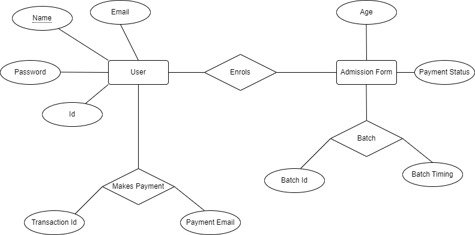

# Yoga Classes App


## Overview

This project is a web application for managing yoga classes. It consists of a frontend built with React, a backend using Node.js and Express, and it interacts with Supabase as the database. 
To know more about Supabase it provides a full Postgres database for every project with Realtime functionality, database backups, extensions, and more.

(While executing operations on the website, kindly wait for a minute after submitting form details, the deployed server might take a minute to respond.)
## Features

- User-friendly interface for submitting yoga class admission forms.
- Integration with Supabase for storing form data and batch information.
- Integrated authentication with Google Sign-in powered by Supabase. 
- REST API for handling form submissions and interacting with the database.
- Docker containerization for easy deployment.

## Project Structure


## Setup

1. **Backend:**
   - Navigate to the `/backend` directory.
   - Run `npm install` to install dependencies.
   - Create a Supabase project and update Supabase configuration in `supabaseConfig.js`.
   - Start the backend server: `npm start`.
   - Open your browser at `http://localhost:3001` to view the app.
   - The backend is been on host on `https://yoga-26p2.onrender.com`
   - Use the endpoint `/api/admission/submit` to test our REST API.
   - If you run a GET request on above endpoint you will get `{"message":"GET request received for /api/admission/submit"}`
   - You can POST request using Postman, enter 
        {
        "name": "Ronny",
        "age": "21",
        "selected_batch": "7-8AM"
        }

2. **Frontend:**
The frontend is built using React, and it communicates with the backend via the REST API.
The admission form is displayed using a React component (AdmissionForm.js).
When the form is submitted, it sends a POST request to the backend API endpoint.

   - Navigate to the `/frontend` directory.
   - Run `npm install` to install dependencies.
   - Start the frontend application: `npm start`.
   - Open your browser at `http://localhost:3000/` to view the app.
   - The frontend is been on host on `https://form-bvx3.onrender.com/`

## Docker Deployment
This web app project has been containerized using Docker, a platform for developing, shipping, and running applications in containers. Containerization allows you to package the application and its dependencies into a single unit, known as a container, ensuring consistency across different environments.
To deploy this app as a Docker container, you will need to have Docker installed on your machine. Once Docker is set up, follow these steps:
- Create a file named Dockerfile & .dockerignore in your root directory & write some required code in the file.
- Open your terminal type `docker images ls`, this will show you some docker images if you have any docker images already.
- We will then build our docker image by running the following command:
  `docker build -t reactimgg .`
- Once the image is build we can check it on our Docker Hub, or run the following command in our terminal to see all files in it:
  `docker run -it reactimgg /bin/sh`
- Once the docker image is built, we can run it using the following command:
  `docker run reactimgg`

    The docker containerization has already been taken care of, so you can jump to below steps!

## Logging in to Docker Hub
1. Open your terminal or command prompt.
2. Run the following command to log in to Docker Hub:
   ```bash
   docker login
3. Enter your Docker Hub username and password when prompted.
4. Once logged in, you can pull the Docker image from Docker Hub.
5. Run the following command to pull the Docker image:
   `docker pull ronny03/reactimgg`
6. To check if all the files are available in the docker image, run the following command:
    `docker run -it ronny03/reactimgg /bin/sh`
7. If you want to view the code inside that file, run the following command:
    `cat example.js`
8. After pulling the image, you can run a Docker container based on that image.
   Use the following command to run the Docker container:
   `docker run -p 3001:3001 ronny03/reactimgg`
9. To stop the running Docker container, use the following command:
   `docker stop <container_id>`
10. Optionally, you can remove the Docker image from your local machine if needed.
    Run the following command to remove the Docker image:
    `docker image rm ronny03/reactimgg`


This section provides a step-by-step guide for Docker deployment, including logging in, pulling the image, running the container, stopping the container, and cleaning up. Adjust the commands and instructions based on your specific requirements.

## ER Diagram for Database Design:

More description on ER Diagrams in folder (ER Diagram), ref ER.txt



## Accessing the App

- Frontend: http://localhost:3000 or https://form-bvx3.onrender.com/
- Backend (API): http://localhost:3001 or https://yoga-26p2.onrender.com/api/admission/submit
- Docker Hub (Container): https://hub.docker.com/r/ronny03/reactimgg

## REST API Endpoints

- `/api/admission/submit` (POST): Submit yoga class admission form.

## Contributing

Feel free to contribute to this project by opening issues or submitting pull requests. Your feedback and contributions are highly appreciated!


